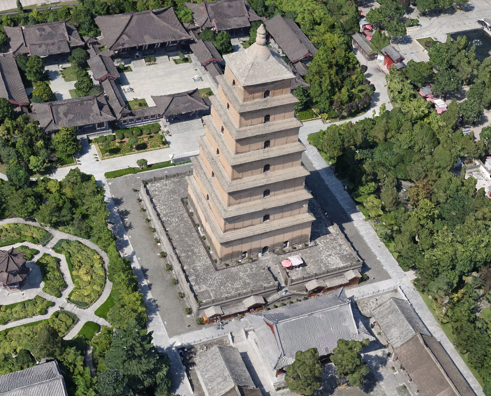
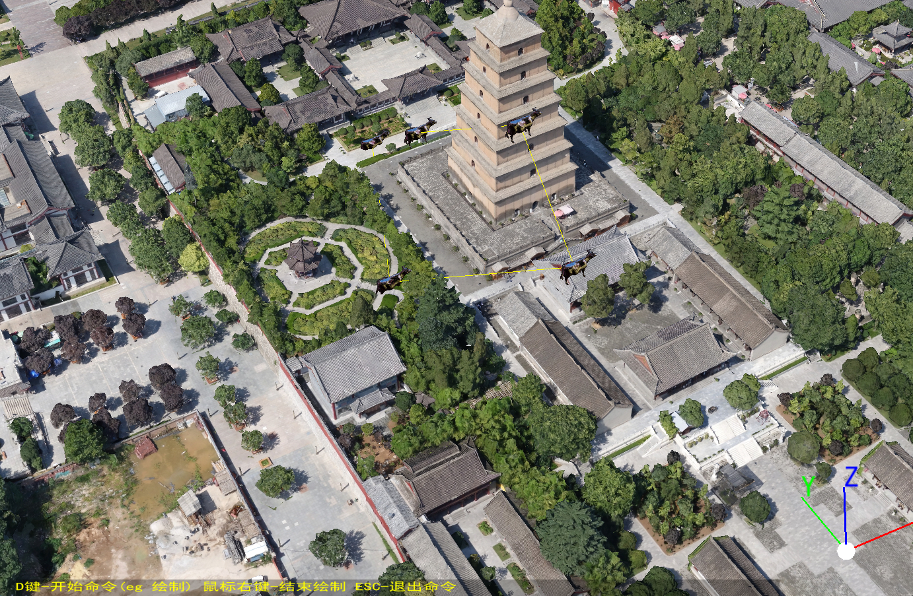
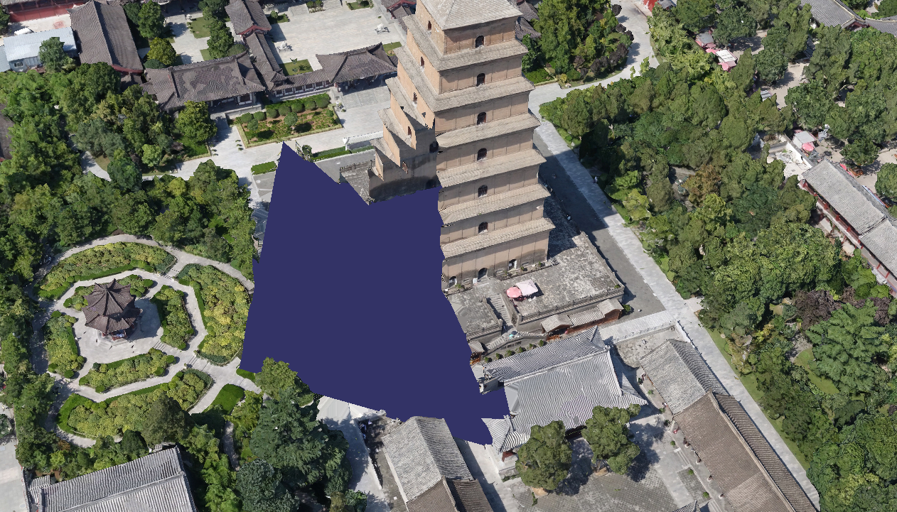
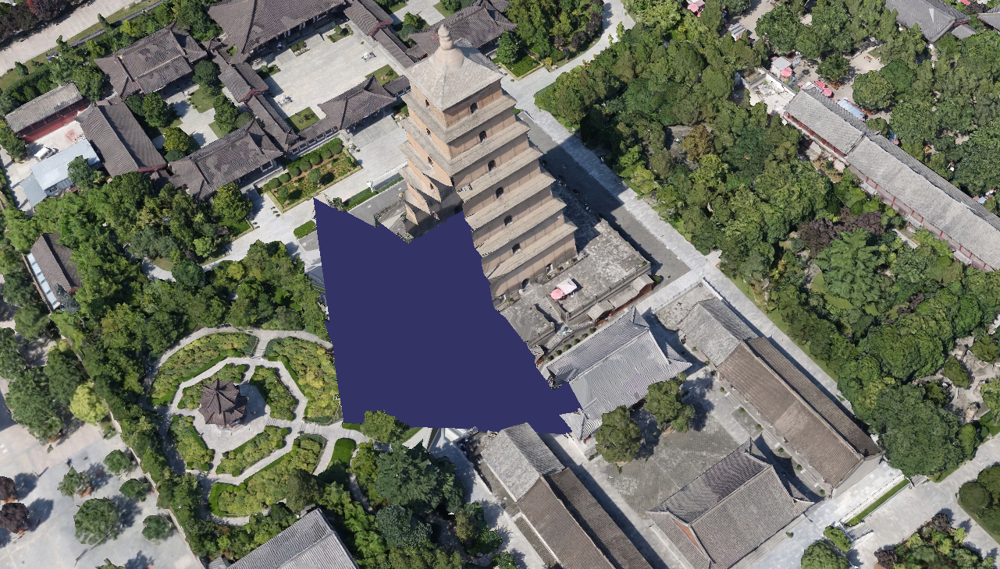



# iMyGIS平台
iMyGIS平台 由 iMyGIS Group 维护。保留所有权利。

This project is actively developed by the iMyGIS Group. All Rights Reserved.

## 风险提示
若君欲用，风险自担。

## iMyGIS平台之工具集 ObliquePhotographyFileExtraction.exe 工具 区域挖洞
### 使用场景
当项目的规划或设计方案数据与现状三维场景模型融合后，为了让场景浏览更加美观舒适，需要对重合区域的现状数据进行隐藏或删除处理。

### 功能介绍
对与规划或设计方案模型重合的现状地形、倾斜模型数据进行挖洞处理，使模型与现状场景完美融合。

```
ObliquePhotographyFileExtraction.exe --InputDataPath=string --OutputDataPath=string [options] ...
options:
  -i, --InputDataPath           输入文件存放路径, 该路径下应该包含 metadata.xml, Data/ (string)
  -o, --OutputDataPath          输出文件存放路径 (string)
  -m, --ModelReferencePath      参考模型存放路径 (string [=])
  -c, --ClipRegion              输入文件限定范围 "-100,-100,-100,50,50,50,100,100,100" (string [=])
  -u, --ZMaxOffset              裁切范围向上Z偏移值 +ZMaxOffset (double [=1])
  -d, --ZMinOffset              裁切范围向下Z偏移值 -ZMinOffset (double [=1])
  -s, --Skirt                   创建裙边Skirt
  -b, --ClipUsingBoundingBox    使用不精确的包围盒近似裁切
  -?, --help                    print this message
```

### 使用举例
```
ObliquePhotographyFileExtraction.exe --OutputDataPath=output/path/ --InputDataPath=input/path/

ObliquePhotographyFileExtraction.exe -o output/path/ -i input/path/
```

### 效果举例
裁切挖洞前



选择裁切范围



裁切挖洞后






## 交流、捐赠支持 Sponsors、贡献与参与 Contributing
关于iMyGIS平台，若有兴趣，联系作者。🌹

If you are interested, contact the author.

如果 iMyGIS平台 帮助到了您，您可以请作者喝杯咖啡表示鼓励 ☕️。

iMyGIS appreciates contributions of all kinds. We especially want to thank our fiscal sponsors who contribute to ongoing project maintenance.

我正在寻找新工作。如果您有兴趣雇佣我，请随时发送电子邮件到 imygis@sina.cn 📧

I am currently seeking funds to keep a roof over our head and looking for a new job. If you're interested in hiring me, please feel free to email me @ <imygis@sina.cn>

您也可以使用微信和QQ联系到我。✍

You can also use WeChat and QQ to reach me。

### 微信 wxid_doci96iau9un22


### QQ 交流群 901291659


