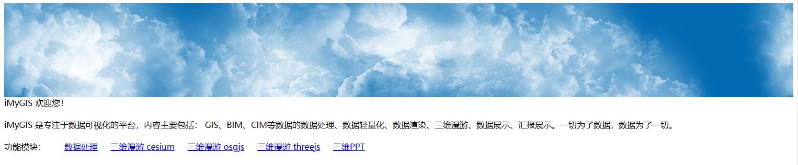

# iMyGIS平台

iMyGIS 是专注于数据可视化的平台，内容主要包括：GIS、BIM、CIM等数据的数据处理、数据轻量化、数据渲染、三维漫游、数据展示、汇报展示。一切为了数据，数据为了一切。

[iMyGIS平台 在线体验 阿里云部署](http://8.140.243.75/imygis/)

[iMyGIS平台 在线体验 Gitee部署](https://imygis.gitee.io/)

[iMyGIS平台 在线体验 GitHub部署](https://imygis.github.io/)

iMyGIS平台 由 iMyGIS Group 维护。保留所有权利。

This project is actively developed by the iMyGIS Group. All Rights Reserved.

## 功能模块
- 数据处理：[地理信息基础数据处理低代码开发系统](https://imygis.github.io/web/graphnodeengine.html) 和 工具集

- 数据渲染/三维漫游：集成了 [OSG](https://github.com/openscenegraph/OpenSceneGraph) [KlayGE](https://github.com/gongminmin/KlayGE) [OGRE](https://www.ogre3d.org/) [Cesium](https://imygis.github.io/web/spatialexplorer.cesium.html) [osg.js](https://imygis.github.io/web/spatialexplorer.osgjs.html) [three.js](https://imygis.github.io/web/spatialexplorer.threejs.html) 等引擎

- 数据展示：[三维汇报/三维PPT](https://imygis.github.io/web/presentationslides.html) 为工程设计提质增效。

## 风险提示
若君欲用，风险自担。

If you want to use it, at your own risk.

## 数据渲染/三维漫游

## 数据展示

## 数据处理

### 工具集 部分功能列表

#### Cesium3DTilesMergeTileset
---
- [ ] @todo 简述待补充
```
Cesium3DTilesMergeTileset.exe --InputDataPath=string --OutputDataPath=string [options] ...
options:
  -i, --InputDataPath     输入文件(本地文件/网络文件)   eg: 倾斜摄影 输入文件存放路径, 该路径下应该包含 metadata.xml, Data/ (string)
  -o, --OutputDataPath    输出文件存放路径 (string)
  -?, --help              print this message
```

#### Cesium3DTilesDownloadTileset
---
- [ ] @todo 简述待补充
```
Cesium3DTilesDownloadTileset.exe --InputDataPath=string --OutputDataPath=string [options] ...
options:
  -i, --InputDataPath     输入文件(网络文件) (string)
  -o, --OutputDataPath    输出文件存放路径 (string)
  -?, --help              print this message
```

#### Cesium3DTiles23DTiles
---
- [ ] @todo 简述待补充
```
Cesium3DTiles23DTiles.exe --InputDataPath=string --OutputDataPath=string [options] ...
options:
  -i, --InputDataPath     输入文件(本地文件/网络文件)   eg: 倾斜摄影 输入文件存放路径, 该路径下应该包含 metadata.xml, Data/ (string)
  -o, --OutputDataPath    输出文件存放路径 (string)
  -r, --InputDataType     输入文件类型 (string [=b3dm])
  -t, --OutputDataType    输出文件类型 (string [=glb])
  -?, --help              print this message
```

#### Cesium3DTilesValidateTileset
---
- [ ] @todo 简述待补充
```
Cesium3DTilesValidateTileset.exe --InputDataPath=string --OutputDataPath=string [options] ...
options:
  -i, --InputDataPath     输入文件(本地文件/网络文件)   eg: 倾斜摄影 输入文件存放路径, 该路径下应该包含 metadata.xml, Data/ (string)
  -o, --OutputDataPath    输出文件存放路径 (string)
  -?, --help              print this message
```

#### ModelPipe
---
- [ ] @todo 简述待补充
```
ModelPipe.exe --InputDataPath=string --OutputDataPath=string [options] ...
options:
  -i, --InputDataPath     输入文件(PipeExcel(*.xlsx)) (string)
  -o, --OutputDataPath    输出文件存放路径 (string)
  -g, --GpuInstancing     GpuInstancing EXT_mesh_gpu_instancing
  -?, --help              print this message
```

#### Fbx2Glb
---
- [ ] @todo 简述待补充
```
Fbx2Glb.exe --InputDataPath=string --OutputDataPath=string [options] ...
options:
  -i, --InputDataPath                          输入文件 (string)
  -o, --OutputDataPath                         输出文件夹 (string)
  -r, --SeperateRule                           拆分结点规则 (string [=GlbOnly])
  -d, --ModelWithoutJudgmentOfInstance         指定拆分时, 不参与实例几何体的判断, 直接输出的模型 (string [=])
  -x, --PrimitiveSetConvertIndex               是否转换为索引图元
  -p, --SetPrecisionToReduceTheAmountOfData    是否设置数据精度
  -m, --SeperateMaterials                      是否分离材质
  -t, --SeperateImages                         是否分离贴图
  -c, --CompressTextureFormat                  压缩图片格式 (string [=])
  -?, --help                                   print this message
```

#### GeographicData2GeographicData
---
- [ ] @todo 简述待补充
```
GeographicData2GeographicData.exe --In=string --Out=string [options] ...
options:
  -i, --In                         输入文件存放路径 (string)
  -o, --Out                        输出文件存放路径 (string)
  -s, --SRSFrom                    输入文件坐标系EPSG (string [=EPSG:4549])
  -d, --SRSTo                      输出文件坐标系EPSG (string [=EPSG:4326])
  -t, --InputDataType              输入文件类型 (string [=EsriShapefile])
  -u, --OutputDataType             输出文件类型 (string [=GeoJSON])
  -p, --SeparateModelProperties    模型属性分离开关: 属性内联的好处-管理简单 属性外挂的好处-数据量小 便于统计分析
  -?, --help                       print this message
```

#### ModelViewer
---
- [ ] @todo 简述待补充
```
ModelViewer.exe [options] filename ...
Options:
  --dem <filename>  Load an image/DEM and render it on a HeightField
  --device <device-name>
                    add named device to the viewer
  --help-all        Display all command line, env vars and keyboard & mouse
                    bindings.
  --help-env        Display environmental variables available
  --help-keys       Display keyboard & mouse bindings available
  --image <filename>
                    Load an image and render it on a quad
  --login <url> <username> <password>
                    Provide authenticatispyon information for http file access.
  --speed <factor>  Speed factor for animation playing (1 == normal speed).
  -h or --help      Display command line parameters
  -p <filename>     Play specified camera path animation file, previously saved
                    with 'z' key.
```

#### ObliquePhotographyFileExtraction
---
- [ ] @todo 简述待补充
```
ObliquePhotographyFileExtraction.exe --InputDataPath=string --OutputDataPath=string [options] ...
options:
  -i, --InputDataPath             输入文件存放路径, 该路径下应该包含 metadata.xml, Data/ (string)
  -o, --OutputDataPath            输出文件存放路径 (string)
  -m, --ModelReferencePath        参考模型存放路径 (string [=])
  -c, --ClipRegion                输入文件限定范围 "-100,-100,-100,50,50,50,100,100,100" (string [=])
  -u, --ZMaxOffset                裁切范围最大Z偏移值 (double [=100])
  -d, --ZMinOffset                裁切范围最小Z偏移值 (double [=100])
  -s, --Skirt                     创建裙边Skirt
  -b, --CompareBoundingBoxOnly    CompareBoundingBoxOnly
  -?, --help                      print this message
```

#### ObliquePhotographyMerge
---
- [ ] @todo 简述待补充
```
ObliquePhotographyMerge.exe --InputDataPath=string --OutputDataPath=string [options] ...
options:
  -i, --InputDataPath     输入文件(本地文件/网络文件)   eg: 倾斜摄影 输入文件存放路径, 该路径下应该包含 metadata.xml, Data/ (string)
  -o, --OutputDataPath    输出文件存放路径 (string)
  -?, --help              print this message
```

#### ObliquePhotography2OrthophotoMap
---
- [ ] @todo 简述待补充
```
ObliquePhotography2OrthophotoMap.exe --In=string --Out=string [options] ...
options:
  -i, --In                 输入文件存放路径, 该路径下应该包含 metadata.xml, Data/ (string)
  -o, --Out                输出文件存放路径 (string)
  -g, --Gsd                地面分辨率GSD(米/像素) (double [=1])
  -m, --MaxImageSize       图片最大尺寸(像素) (unsigned int [=15000])
  -t, --OutputImageType    输出图片格式 (string [=png])
  -p, --SRSTo              目标投影类型 (string [=EPSG:4326])
  -?, --help               print this message
```

#### Osg2Osg
---
- [ ] @todo 简述待补充
```
Osg2Osg.exe --InputDataPath=string --OutputDataPath=string [options] ...
options:
  -i, --InputDataPath                                     输入文件(本地文件/网络文件) eg: 倾斜摄影 输入文件存放路径, 该 路径下应该包含 metadata.xml, Data/ (string)
  -o, --OutputDataPath                                    输出文件存放路径 (string)
  -r, --InputDataType                                     输入文件类型 (string [=osgb])
  -t, --OutputDataType                                    输出文件类型 (string [=osgb])
  -f, --Cesium_Cesium3DTileset_MaximumScreenSpaceError    Cesium的几何误差调整系数，GeometricError在Cesium中被用于计算ScreenSpaceError (double [=16])
  -g, --GltfSpecification                                 glTF文件版本 (string [=GLTF2.0])
  -a, --GltfUpAxis                                        GltfUpAxis (string [=Z])
  -m, --MergeTilesetJsonInOneFile                         将所有tileset写入一个json文件中
  -p, --PointwiseTransformation                           逐点变换
  -u, --USE_KHR_techniques_webgl                          glTF的材质使用KHR_techniques_webgl
  -c, --USE_Cesium_Outline                                USE_Cesium_Outline
  -h, --MergeOsgPrimitiveSets                             MergeOsgPrimitiveSets
  -s, --SeperateOsgGeode                                  SeperateOsgGeode
  -z, --HeightOffset                                      "EPSG:4326"下高程调整值 (double [=0])
  -?, --help                                              print this message
```

#### ProductInfo
---
- [ ] @todo 简述待补充
```
ProductInfo.exe
```

#### PyramidIndexExtraction
---
- [ ] @todo 简述待补充
```
PyramidIndexExtraction.exe --In=string --Out=string [options] ...
options:
  -i, --In                            输入文件存放路径, 该路径下应包含下面这些文件 ./metadata.xml ./Data/ ./*.s3c (string)
  -o, --Out                           输出文件存放路径 (string)
  -d, --DataType                      数据类型 (string [=ObliquePhotography])
  -h, --FileType                      文件类型 (string [=osgb])
  -p, --TotalGraphOccupancyPixels     在俯视视角下全图占用像素参考值 (unsigned int [=256])
  -f, --GenerateProxyNodeInOneFile    将代理节点存入一个文件
  -r, --ReLocateOriginBlock           检测到原始数据分块过小时重新分块
  -g, --BaseTileRegex                 原始数据瓦片命名规则 (string [=([^_]*)_([\+\-0-9]*)_([\+\-0-9]*)])
  -t, --PowerOfTwoTexture             POT贴图支持，强制输出贴图为2的幂次方
  -x, --OnePixelBorder                拼图时子图间隔一像素
  -a, --TexturePacker                 拼图算法 (string [=JohnRatcliffTexturePacker])
  -e, --TileExtractionCount           决定将几个子Tile抽取为一个父Tile (string [=2x2])
  -?, --help                          print this message
```

## 安装

双击安装包开始安装<br>
```
setup\iMyGIS-Client-x.y.z-YYYY.exe
```
首先选择安装位置<br>
<br>
开始安装<br>
<br>
安装过程中<br>
<br>
软件运行需要VC运行时支持，安装过程中会自动提示安装。若已经安装过，“关闭”跳过即可<br>
<br>
关闭VC运行时安装会询问，是即可<br>
<br>
软件安装完成后需要重启电脑<br>
<br>
软件安装完成后桌面快捷方式<br>
<br>

## 交流、捐赠支持 Sponsors、贡献与参与 Contributing

关于iMyGIS平台，若有兴趣，联系作者。🌹

If you are interested, contact the author.

如果 iMyGIS平台 帮助到了您，您可以请作者喝杯咖啡表示鼓励 ☕️。

iMyGIS appreciates contributions of all kinds. We especially want to thank our fiscal sponsors who contribute to ongoing project maintenance.

我正在寻找新工作。如果您有兴趣雇佣我，请随时发送电子邮件到 imygis@sina.cn 📧

I am currently seeking funds to keep a roof over our head and looking for a new job. If you're interested in hiring me, please feel free to email me @ <imygis@sina.cn>

您也可以使用微信和QQ联系到我。✍

You can also use WeChat and QQ to reach me。

### 微信 wxid_doci96iau9un22


### QQ 交流群 901291659


