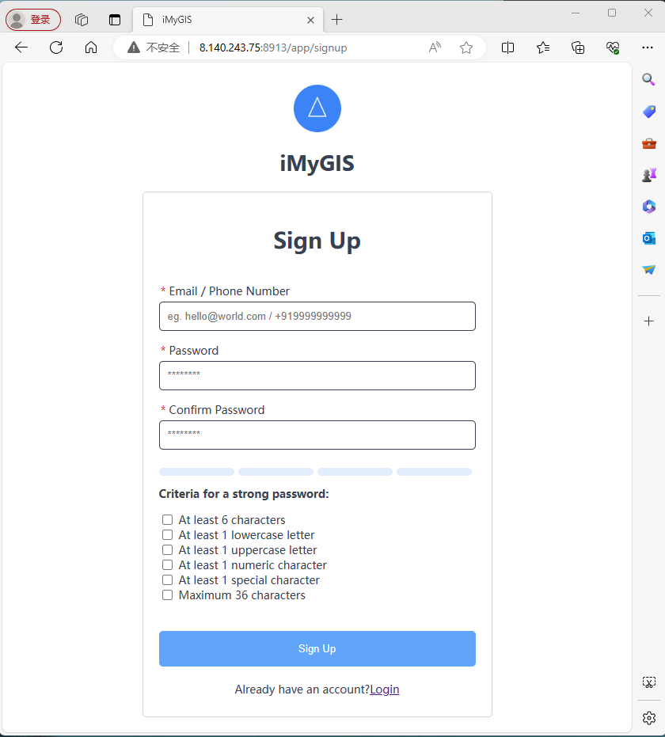
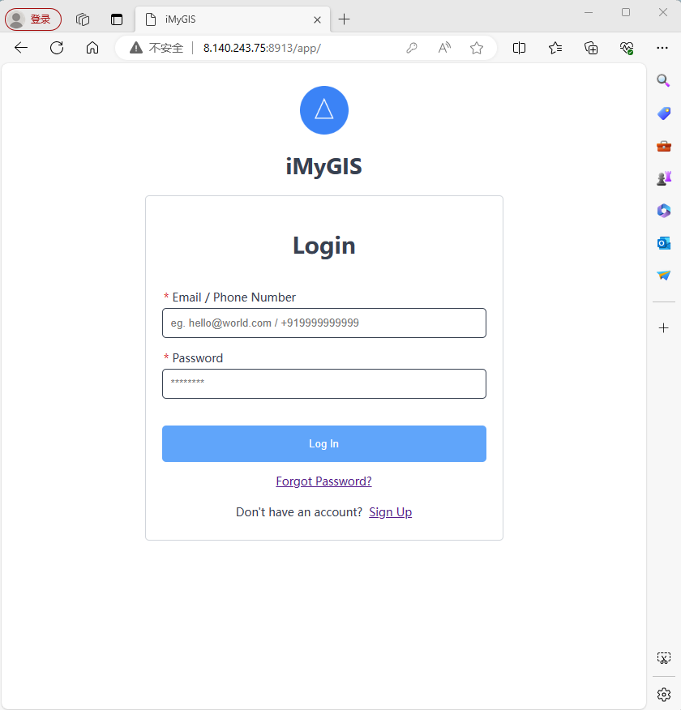
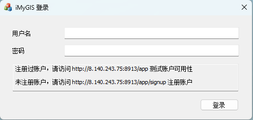
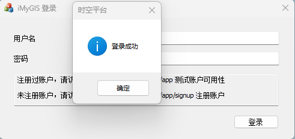



# iMyGIS平台

iMyGIS平台 由 iMyGIS Group 维护。保留所有权利。

This project is actively developed by the iMyGIS Group. All Rights Reserved.

## iMyGIS平台之注册与登录

在使用 iMyGIS平台 各种功能前，需要先登录。

未注册账户，请访问 http://8.140.243.75:8913/app/signup 注册账户

注册过账户，请访问 http://8.140.243.75:8913/app 测试账户可用性

客户端登录

客户端登录成功后，才可使用客户端各种功能。在使用客户端功能时，若未登录，则会自动跳出登录框提示用户登录。

## 交流、捐赠支持 Sponsors、贡献与参与 Contributing
关于iMyGIS平台，若有兴趣，联系作者。🌹

If you are interested, contact the author.

如果 iMyGIS平台 帮助到了您，您可以请作者喝杯咖啡表示鼓励 ☕️。

iMyGIS appreciates contributions of all kinds. We especially want to thank our fiscal sponsors who contribute to ongoing project maintenance.

我正在寻找新工作。如果您有兴趣雇佣我，请随时发送电子邮件到 imygis@sina.cn 📧

I am currently seeking funds to keep a roof over our head and looking for a new job. If you're interested in hiring me, please feel free to email me @ <imygis@sina.cn>

您也可以使用微信和QQ联系到我。✍

You can also use WeChat and QQ to reach me。

### 微信 wxid_doci96iau9un22

### QQ 交流群 901291659

