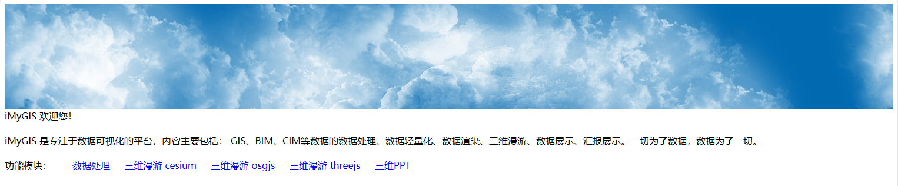
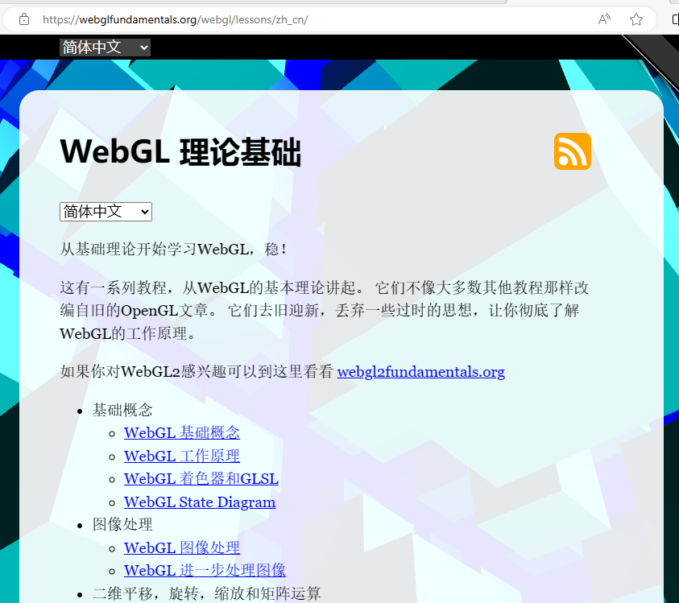
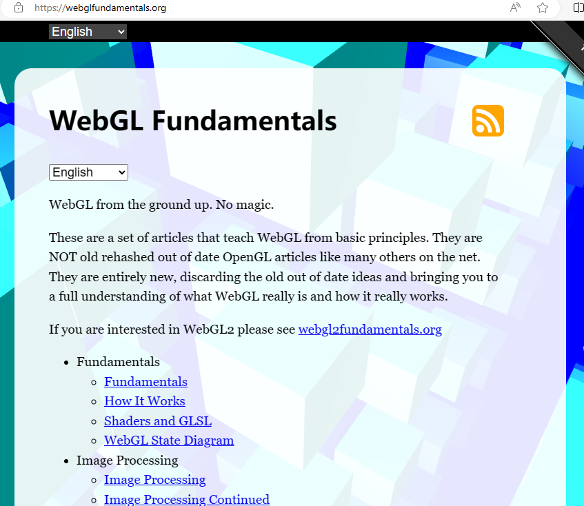
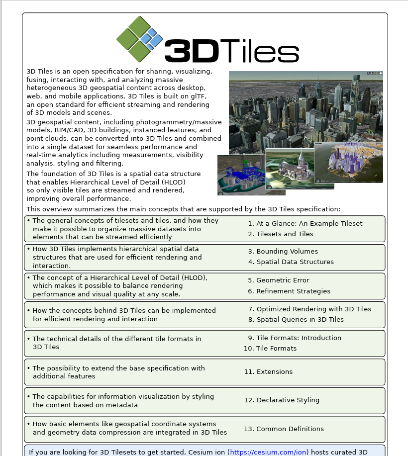
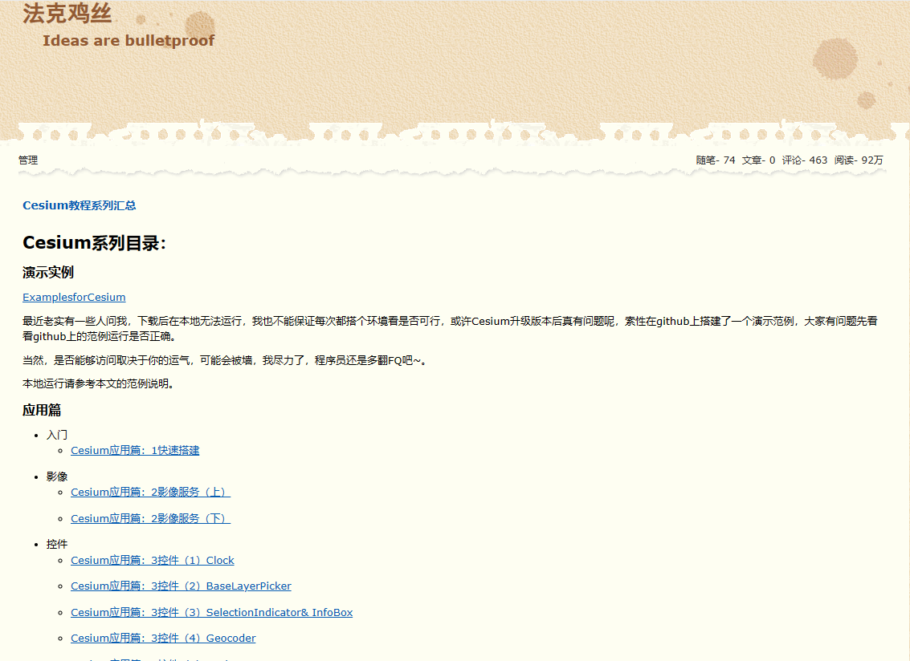
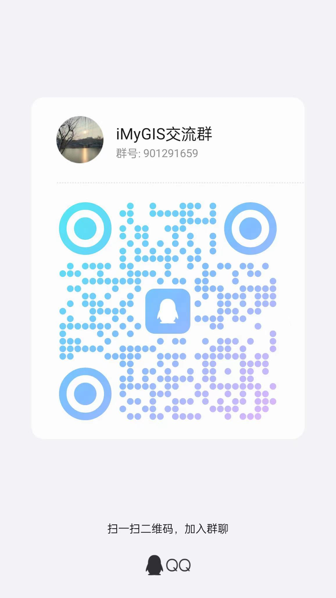



# iMyGIS平台

iMyGIS平台 由 iMyGIS Group 维护。保留所有权利。

This project is actively developed by the iMyGIS Group. All Rights Reserved.

## iMyGIS平台之三维学习成长：学习 Cesium 的一些建议
iMyGIS Platform for 3D Learning and Growth: Suggestions for learning Cesium

### 整个学习过程中要逐步培养自己的兴趣和好奇心, 要有发自内心的自我驱动力，这样学习起来就会轻松顺畅。

### 从数据入手，把握数据从客户获取到最终展示效果所经历的全部流转流程。对整个研发链条要有全局的把握。

### 建议 学习 理论基础
WebGL 可以先看看 中文版 https://webglfundamentals.org/webgl/lessons/zh_cn/

然后快速过 英文版 https://webglfundamentals.org/ 英语过关的话也可直接看英文版

glTF 规范 是 3dtiles 的基础，一定要熟练掌握。

https://github.com/KhronosGroup/glTF

https://www.khronos.org/gltf/

3dtiles 规范 一定要熟记于心，是Cesium 主推的数据格式。

https://github.com/CesiumGS/3d-tiles

3DTiles 1.1规范【中文版】 https://zhuanlan.zhihu.com/p/539888387

### 熟悉 GIS 的基本概念
- 坐标系(地理坐标系 地心坐标系 投影坐标系 投影的概念)
- GIS数据格式
- GIS服务(geoserver)
- 会操作常用的GIS软件 ([QGIS](https://qgis.org/en/site/))

其中对于Cesium来说，坐标系的概念一定要弄清。

### 熟悉 Cesium
**建议 跟踪调试一遍 Cesium 渲染流程。**

快速过下官方文档，不要在意细节，有个印象就好。

参看 法克鸡丝 的博客 https://www.cnblogs.com/fuckgiser/p/5706842.html

### 要实践，将 Cesium 对接 业务，一切的技术都要为业务服务，要不多高端的技术都没有意义。
这个需要积累，没有捷径，整个学习过程中多进行PDCA，要多相互交流，每个人都会发现一些闪光点。

## 交流、捐赠支持 Sponsors、贡献与参与 Contributing
关于iMyGIS平台，若有兴趣，联系作者。🌹

If you are interested, contact the author.

如果 iMyGIS平台 帮助到了您，您可以请作者喝杯咖啡表示鼓励 ☕️。

iMyGIS appreciates contributions of all kinds. We especially want to thank our fiscal sponsors who contribute to ongoing project maintenance.

我正在寻找新工作。如果您有兴趣雇佣我，请随时发送电子邮件到 imygis@sina.cn 📧

I am currently seeking funds to keep a roof over our head and looking for a new job. If you're interested in hiring me, please feel free to email me @ <imygis@sina.cn>

您也可以使用微信和QQ联系到我。✍

You can also use WeChat and QQ to reach me。

### 微信 wxid_doci96iau9un22

### QQ 交流群 901291659

